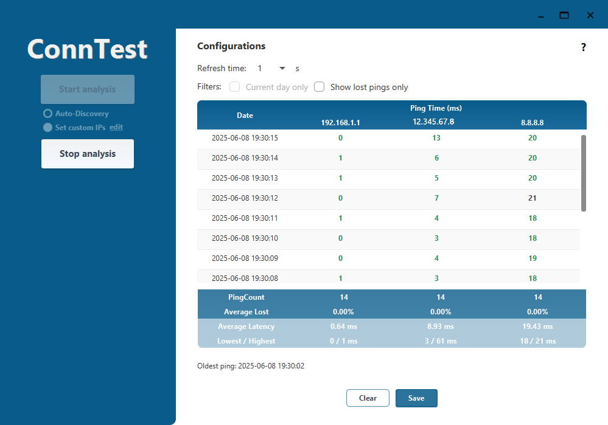

# ConnTest

ConnTest is a desktop application that helps you monitor and analyze the quality of your internet connection in a quick, easy and visual way.

## What does ConnTest do?

- **Tests your connection:** ConnTest checks your internet quality by sending test signals (pings) to different points in your network.
- **Shows connection statistics:** See information like average response time (latency), packet loss, and more, to understand how stable and fast your connection is.
- **Keeps a history:** ConnTest saves your test results so you can review your connection performance over time.
- **Easy to use:** The graphical interface is simple and intuitive—no technical knowledge required.

## Main features

- **Automatic mode:** With one click, ConnTest automatically detects and tests:
    - Your local router (gateway)
    - The first router of your internet provider (ISP)
    - Google DNS (8.8.8.8)
- **Custom mode:** You can manually enter up to 3 IP addresses to test connectivity to specific devices or servers.
- Start and stop connection tests easily.
- View real-time and historical statistics.
- Analyze connection quality for specific devices or time periods.
- Export or clear your test history.

## Who is it for?

ConnTest is ideal for anyone who wants to:

- Check if their internet connection is working properly.
- Detect problems with their internet provider.
- Monitor the stability of their home or office network.

No technical knowledge is required to use ConnTest.

## How does it work?

ConnTest uses standard network tools (like ping and traceroute) to test your connection. The results are shown in a clear and friendly way, so you can easily see if there are problems with your internet.

# ConnTest – UI Interpretation

A tool that continuously monitors network latency by pinging selected IP addresses and logging the results.

---

## 🖥️ Left Panel

- **Start analysis / Stop analysis:**  
  Starts or stops the pinging process.

- **Auto-Discovery / Set custom IPs:**
  - **Auto-Discovery:** Automatically detects which IPs to ping.
  - **Set custom IPs (edit):** Allows manual selection of IP addresses.

---

## ⚙️ Configurations Section

- **Refresh time:**  
  ⏱️ Defines how often (in seconds) the **UI refreshes** to load new pings from the log file.  
  *This does **not** control the ping interval (which is always 1 second).*

- **Filters:**
  - `Current day only`: Shows only today's pings.
  - `Show lost pings only`: Shows only entries with ping failures.

---

## 📊 Ping Table

Each row shows:
- **Date:** Timestamp of the ping.
- **Ping Time (ms):** Latency in milliseconds to:
  - `192.168.1.1`: Local gateway/router
  - `12.345.67.8`: ISP or intermediate hop
  - `8.8.8.8`: Google Public DNS

Example:
Date: 2025-06-08 19:30:13
192.168.1.1: 1 ms
12.345.67.8: 5 ms
8.8.8.8: 20 ms

---

## 📈 Summary Statistics

| Metric            | 192.168.1.1 | 12.345.67.8 | 8.8.8.8     |
|------------------|-------------|-------------|-------------|
| **PingCount**     | 14          | 14          | 14          |
| **Average Lost**  | 0.00%       | 0.00%       | 0.00%       |
| **Avg. Latency**  | 0.64 ms     | 8.93 ms     | 19.43 ms    |
| **Lowest / High** | 0 / 1 ms    | 3 / 61 ms   | 18 / 21 ms  |

---

## 🕒 Footer

- **Oldest ping:**  
  Shows the earliest recorded ping:  
  `2025-06-08 19:30:02`

- **Buttons:**
  - `Clear`: Clears the current ping data.
  - `Save`: Saves the session data to a file.

---

If you have any questions or need help, please contact the support team or check the user guide included with the application.